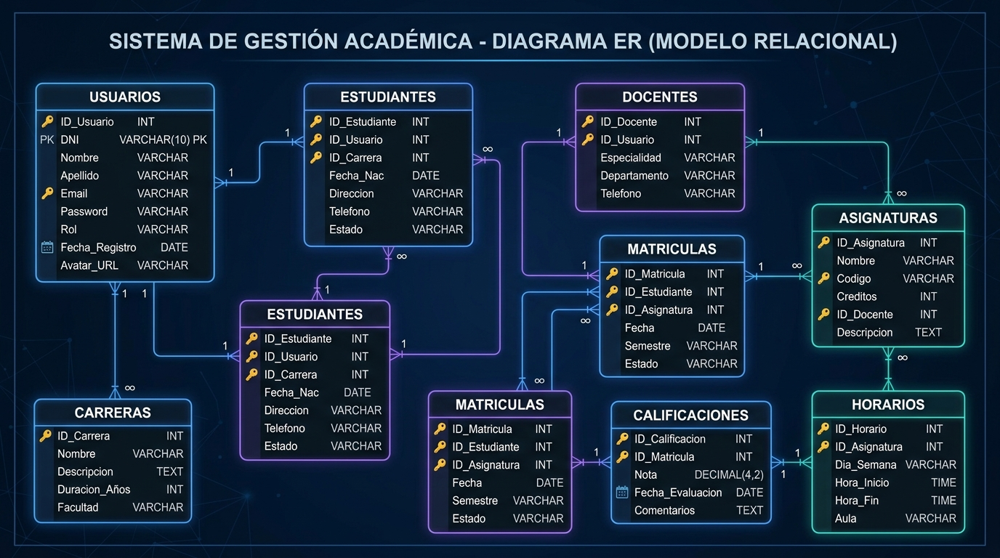
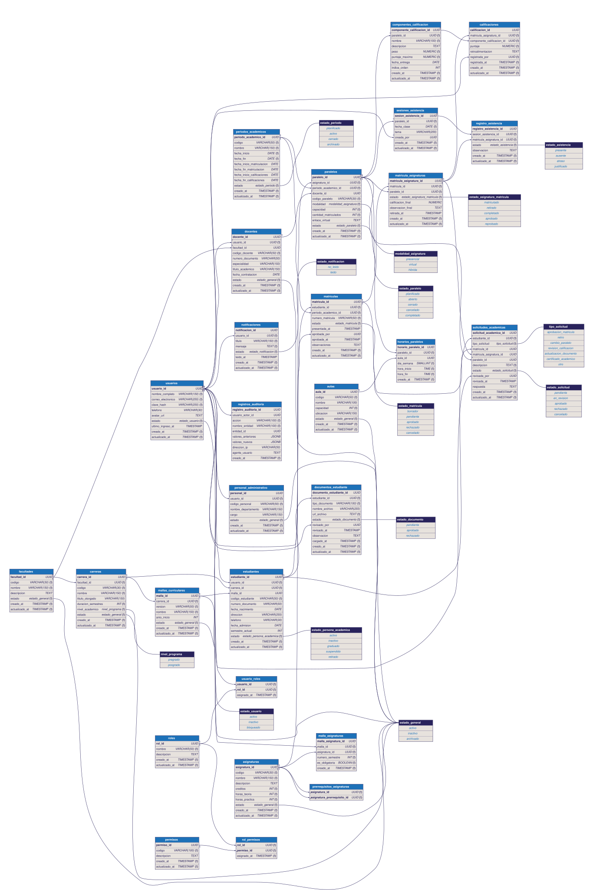
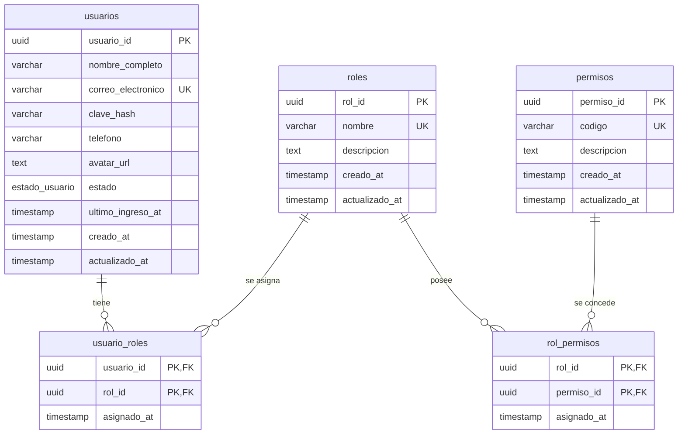
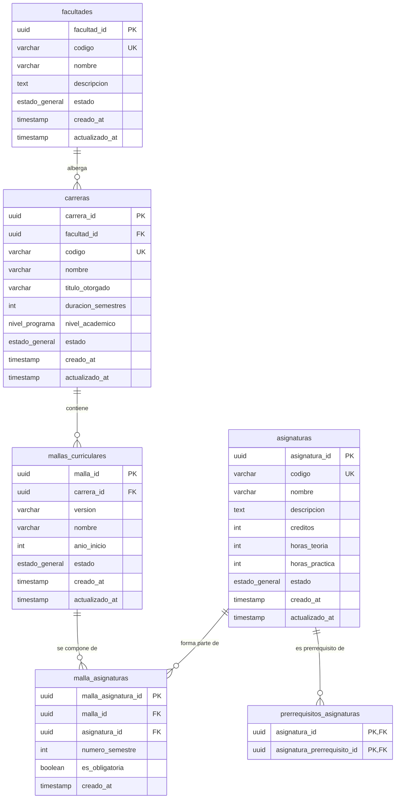
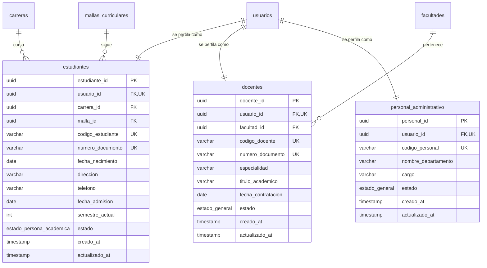
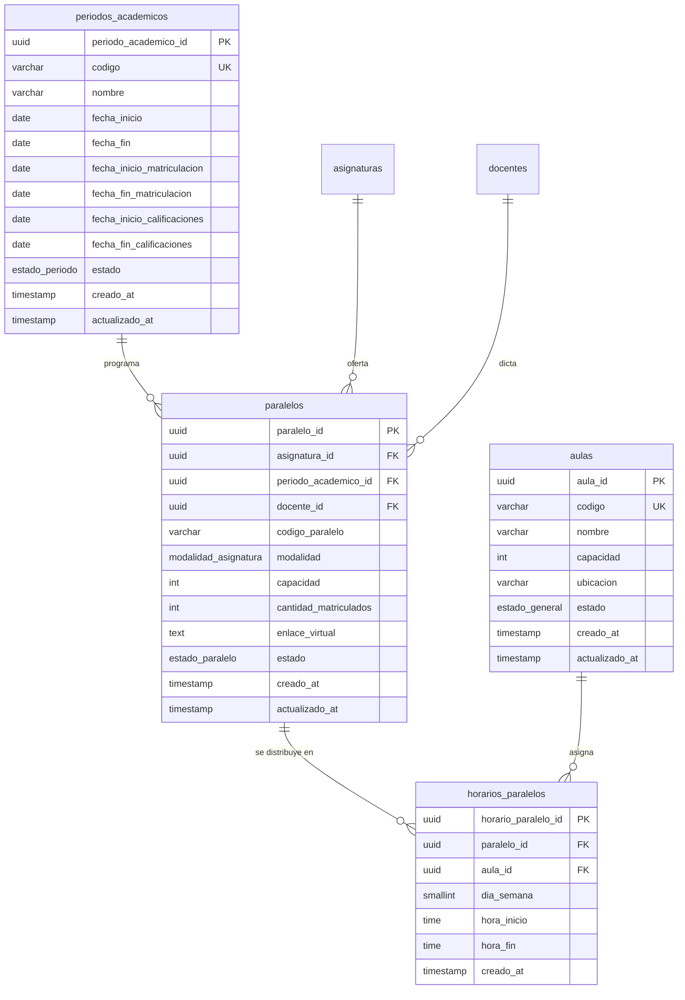
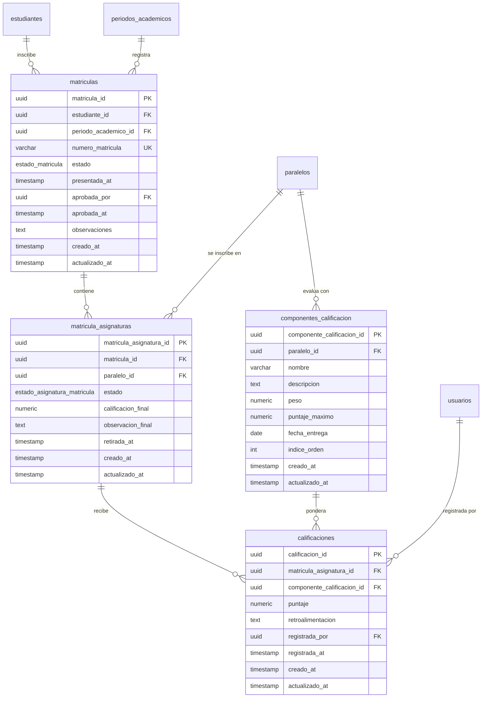
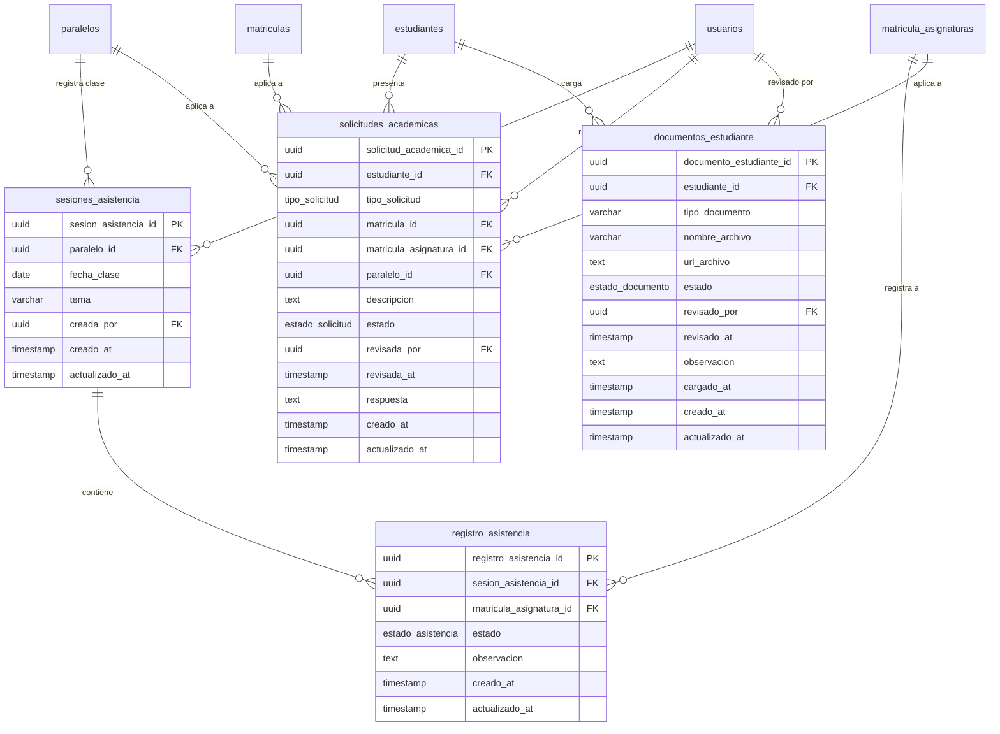
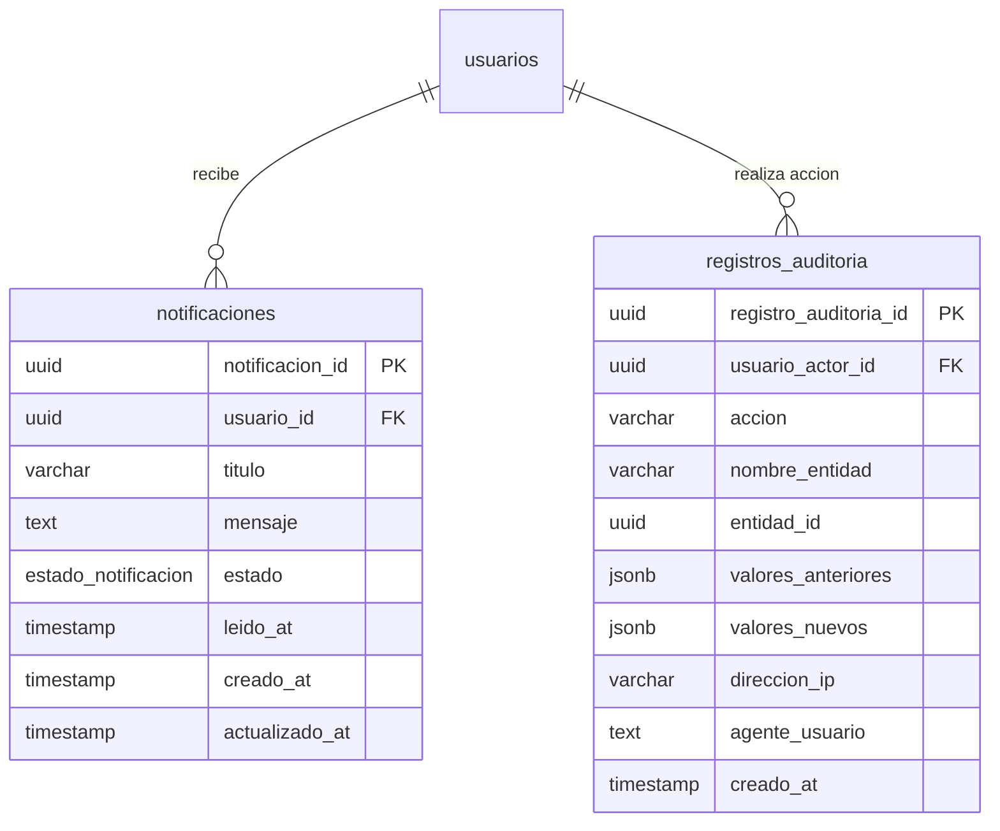

# Diseño y Estructura de la Base de Datos: Sistema de Gestión Académica

Este documento detalla el diseño relacional del esquema `academico` del Sistema de Gestión Académica. Para facilitar la comprensión de las conexiones y dependencias, el esquema de 28 tablas ha sido organizado en **módulos lógicos**.

---

## 1. Módulo de Seguridad e Identidad (RBAC)

Este módulo gestiona la autenticación de usuarios, la definición de roles y la asignación de permisos a nivel de sistema.

---

## 2. Módulo de Estructura Académica

Define la jerarquía académica: las facultades de la universidad, las carreras (pregrado y posgrado), las mallas curriculares vigentes y las asignaturas con sus respectivos prerrequisitos.

---

## 3. Módulo de Personas y Perfiles

Modela los perfiles de los actores universitarios. Los perfiles heredan la información base de la tabla `usuarios` (relación 1:1) y añaden datos específicos de su rol.

---

## 4. Módulo de Planificación y Horarios

Representa la oferta académica: las aulas físicas, los periodos de tiempo académicos, la apertura de paralelos para impartir asignaturas y los horarios semanales de dichos paralelos.

---

## 5. Módulo de Matrículas y Calificaciones

Este módulo registra la inscripción de los estudiantes a los periodos académicos, el detalle de asignaturas inscritas por paralelo, los componentes de evaluación configurados por el docente (deberes, exámenes, etc.) y la nota asignada a cada alumno.

---

## 6. Módulo de Asistencia, Trámites y Documentos

Maneja el registro diario de asistencia por clase, la carga de requisitos o documentos digitales de los estudiantes y el procesamiento de solicitudes académicas y administrativas.

---

## 7. Módulo de Auditoría y Notificaciones

Registra logs de operaciones críticas realizadas por los usuarios para seguridad y cumplimiento (audit logs), y gestiona el envío de alertas y notificaciones a los usuarios dentro del sistema.

